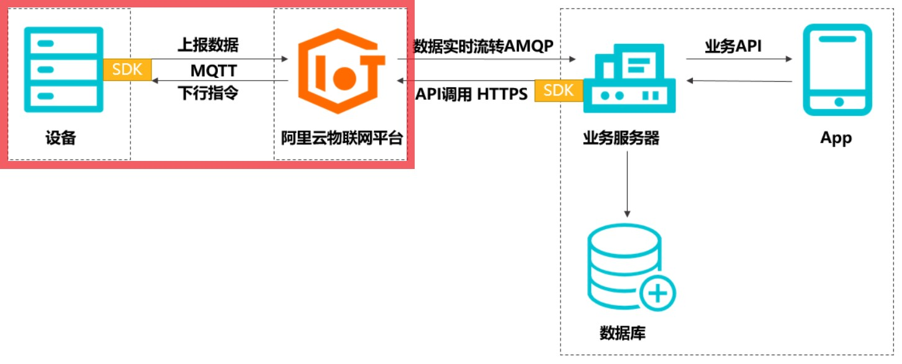

## Solution of Smart Industrial Sensors
## 智能工业传感器解决方案

这是前公司的一个项目，改了改可以在工业物联网的场景下使用。
项目包含了IoT模组、MCU最小系统、传感器数据采集电路，经过实际测试可以完美运行，并已实现量产。
此项目仅仅包含了数据采集和上云的硬件设计与MCU侧的代码（下图红框内的部分），不包含上层业务逻辑的实现（作为MCU工程师，不懂。）

---------------------------------------

#### 硬件介绍
- **主控MCU：STM32F103RET**
- **4G模块：移远通信EC200T Mini PCIe-C**
- 硬件开发软件：Altium Designer (18.1.9)
- 2层PCB板

**[详细电路原理图与PCB设计图](/hardware/README.md)**

---------------------------------------

#### 程序介绍
- 开发环境：Keil uVision V5.23
- 裸机，驱动库版本：Std V3.5.0

坦率的讲，这个MCU代码写的不怎么样，命名规则啥的很混乱，注释也不是很清楚。EC200模块驱动部分我是拿来就用的，当时这个项目还挺急，我也就没重写，导致现在我也看不太懂这一部分的代码了。
这个程序目前存在的问题：与EC200通信的UART2使用的字节中断接收，效率低下，后面考虑改成空闲中断接收。目前跑的裸机程序，毕竟业务简单，后面考虑加上操作系统。

**[详细程序说明](/software/README.md)**

---------------------------------------

#### 未来此项目可能会做的改进
- [ ] 优化消息接收方式
- [ ] 或者直接使用RT-Thread
- [ ] 规范一下函数名、注释
- [ ] 实现物联网下发控制
- [ ] 搞一下微信小程序或者其它APP的东西
- [ ] （终极目标）把家里的空调改成远程控制的，下班回家前提前开机降温。
---------------------------------------

#### 最后没啥用的话

除了阿里云，[小米](https://iot.mi.com/)、[华为](https://www.huaweicloud.com/product/iot.html)都有自己的IOT平台，华为甚至有自己的物联网操作系统[Lite OS](https://www.huaweicloud.com/product/liteos.html)，后面打算看看这是怎么回事。

物联网底层硬件都差不多，CPU加个4G模块，可以实现的业务逻辑有很多。简单一点的比如下面这种（阿里云的图）：

这是一个比较典型的物联网应用，智能插座、智能台灯都是类似的。

稍稍复杂一点的比如下面这种（阿里云的图）：

涉及到了操作系统的问题，芯片可能也不用MCU了，使用高端一点的ARM A8\A9也足够用了。再高端一点的应用还有无人停车场、超市自助收银，涉及到了复杂的上层应用。

