>## 硬件介绍
>- [4G_V1.2](#4G_V1.2)
>    - [1.总体设计](#1.总体设计)
>    - [2.原理图](#2.原理图)
>    - [3.PCB设计图](#3.PCB设计图)
>- [IOT_PCB_V1.3](#IOT_PCB_V1.3)
>    - [1.总体功能设计](#1.总体功能设计)
>    - [2.电源部分](#2.电源部分)
>    - [3.MCU部分](#3.MCU部分)
>    - [4.4G通信模块与外围电路](#4.4G通信模块与外围电路)
>    - [5.外部接口与其他部分](#5.外部接口与其他部分)
>    - [6.PCB设计图](#6.PCB设计图)
>- [IOT_PCB_V1.3的改动说明](#IOT_PCB_V1.3的改动说明)
> 
>

-----
-----

## 4G_V1.2

>这个版本的板子是移远通信EC200模块的最小测试板，仅为EC200提供了电源，并引出了4G模块的关键信号，在实际使用时需要用杜邦线插着配合MCU开发板使用。

 

#### 1.总体设计

 

#### 2.原理图
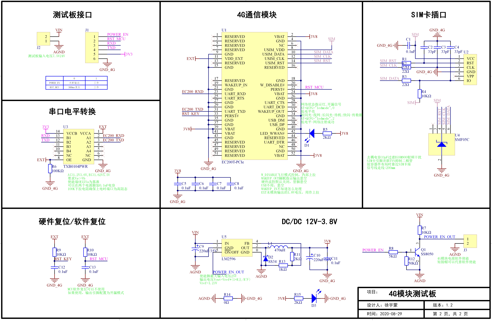

 

#### 3.PCB设计图
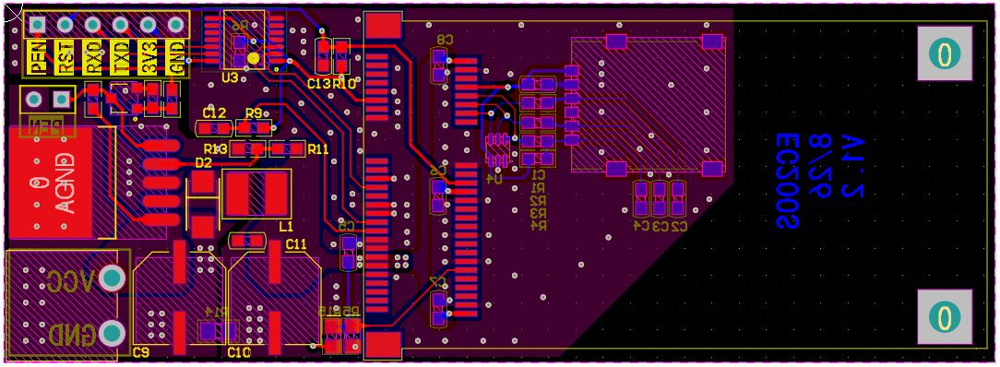
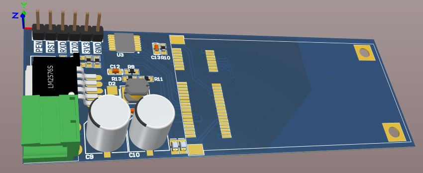
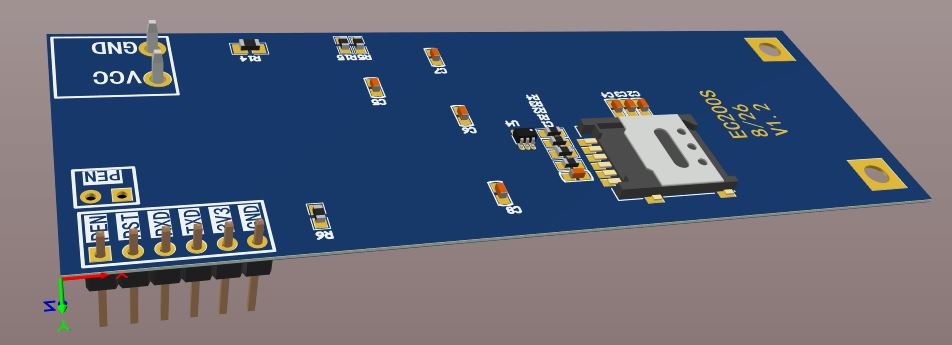

----
----

## IOT_PCB_V1.3
>这块板子在4G模块和MCU上云跑通的基础上加上了业务功能模块。把所有东西和乱七八糟接口画在了一块板子上，底层的东西就那些，要实现智能家居、工业传感器上云、环境温湿远程检测啥的也都差不多，改改也能用。

 

#### 1.总体功能设计
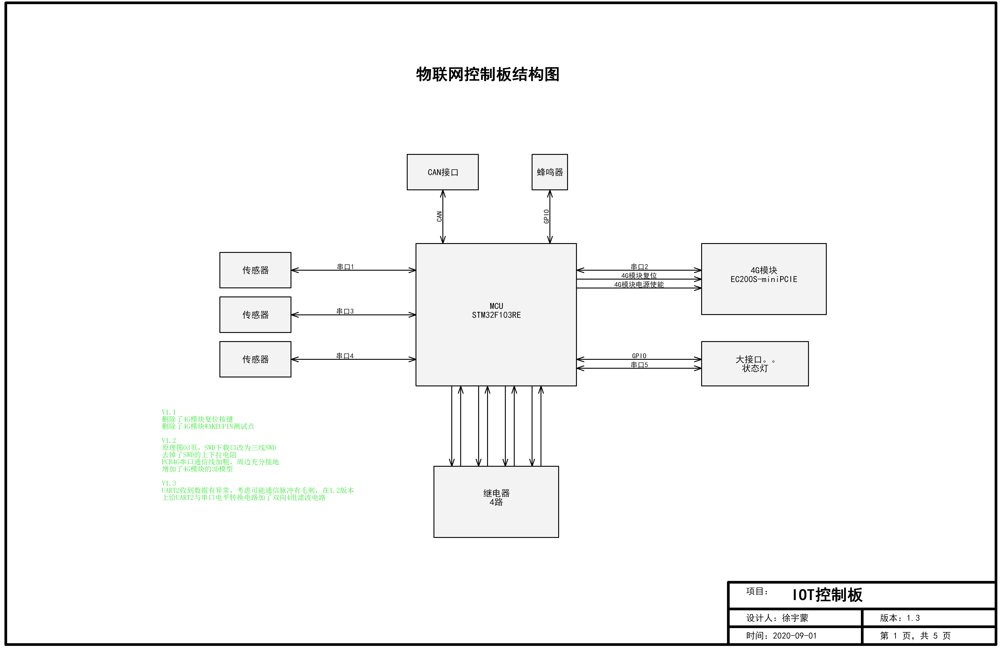

#### 2.电源部分
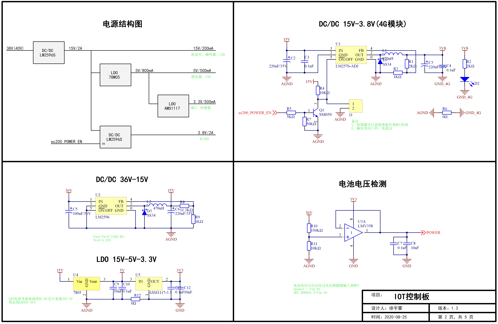

#### 3.MCU部分
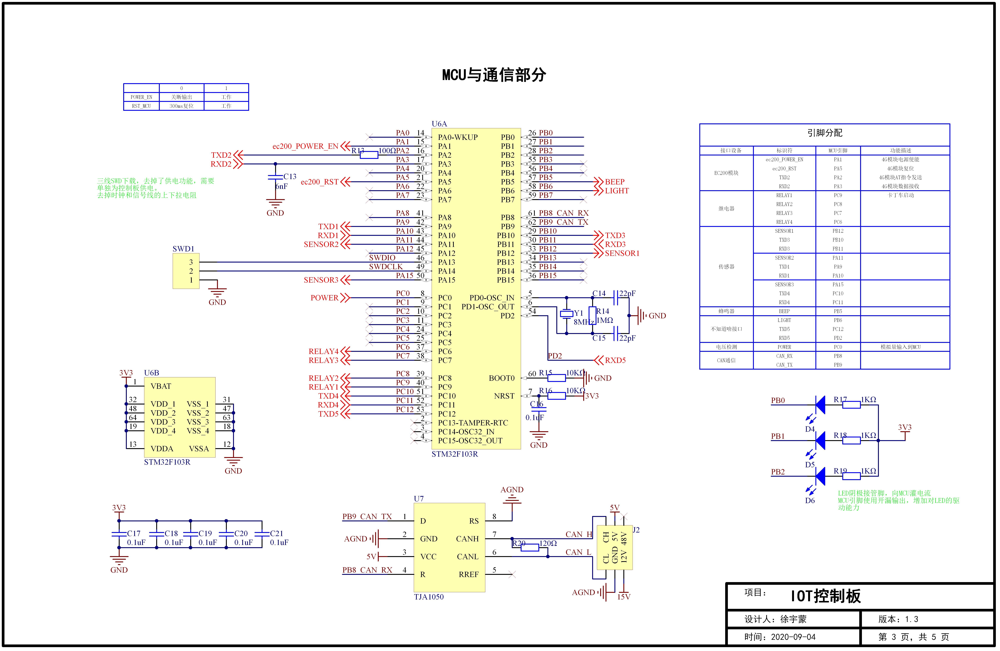

#### 4.4G通信模块与外围电路
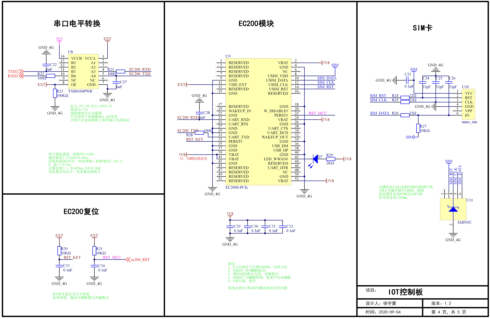

#### 5.外部接口与其他部分
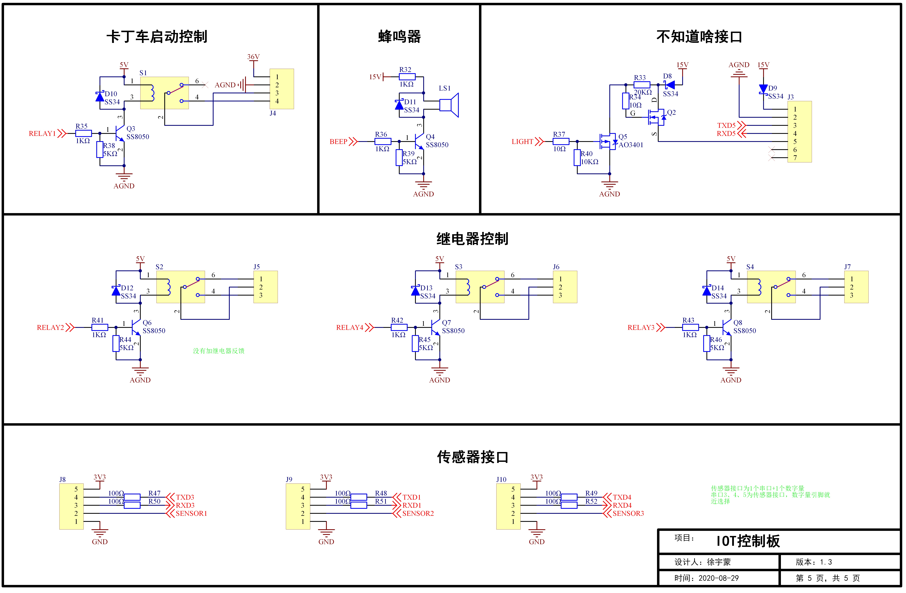

#### 6.PCB设计图
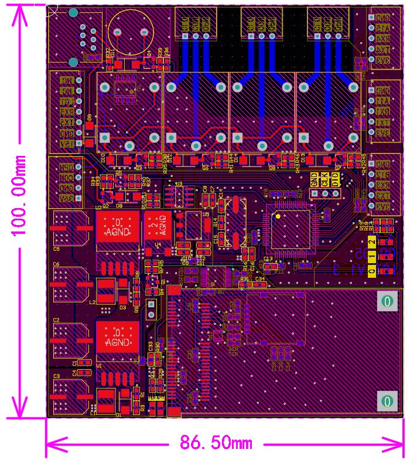
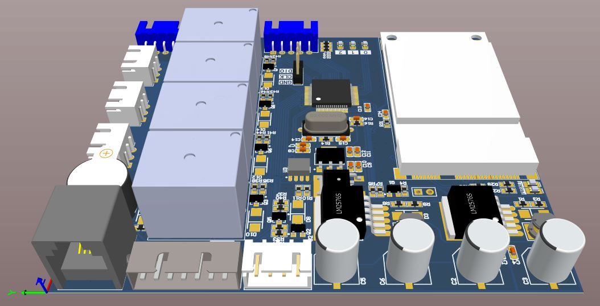
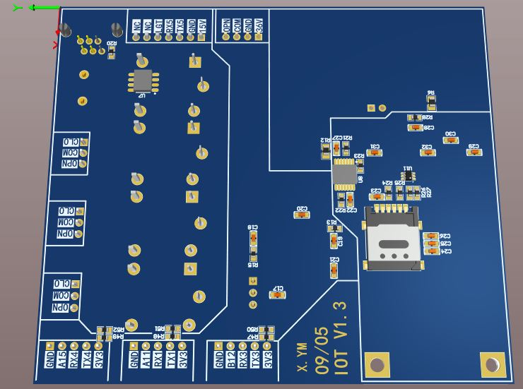

----
----

## IOT_PCB_V1.3的改动说明

- 电源调整

控制板DCDC芯片使用LM2596S-ADJ，可以使用LM2576S替换，15V-3.8V供电部分增加了MCU控制启动功能
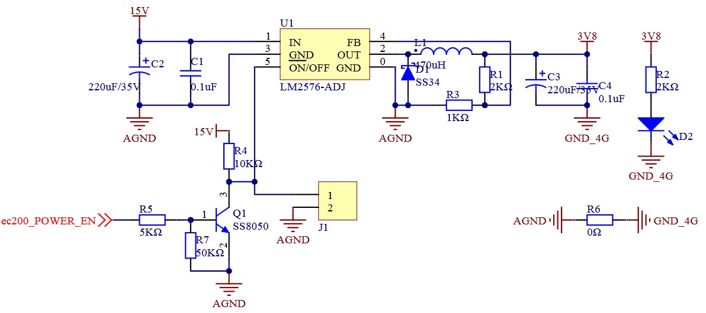
J1为插短接帽的排针，插上可以直接使能3.8V输入为4G模块供电，拔掉以后可以使用MCU引脚控制芯片通断，MCU引脚使用推挽输出模式，0关断输出，1打开输出。
控制板上有电池电压检测接口，使用一个LMV358运放实现电池经过R10，R11分压后送入一个电压跟随器做高低压隔离使用，同时完成了阻抗变换，然后使用0.1uF和10uF电容过滤高低频干扰。

- MCU下载接口调整
MCU的SWD下载接口改为了三线下载模式，取消了供电功能防止下载器与LDO芯片3.3V之间出现压差产生环流，长时间工作损伤下载器或芯片。

- 指示灯调整
MCU的指示灯使用了阴极输入方式，MCU灌电流的能力要强于拉电流的能力，阴极输出可以增加MCU对LED的驱动能力，对应的MCU引脚可以配置为开漏输出模式，防止LED击穿对引脚造成不可逆伤害。

- 4G通复位线调整
EC200模块有两个复位引脚，设计中将复位引脚的RC延时电路上拉到EXT的1.8V输出，MCU的复位控制引脚要配置为开漏输出模式，高阻态不复位，拉低即可实现复位。

- 4G通信线调整
4G模块与MCU的串口通信使用一个电平转换芯片完成，在前面的测试板中，MCU接收会偶尔出现乱码，硬件上存在干扰，V1.3版本中增加了4组串口通信滤波电路。滤波采用RC电路实现，在波特率为115200时，通信脉宽1/115200=8.68us，总线电阻选100Ω，时间常数τ取脉宽的1/10~1/20，取τ=0.6us，计算电容C=τ/R=600ns/100Ω=6nF，在PCB设计时电阻靠近发送方，电容靠近接收方

- 其它
二极管都选用了SMA(DO-214AC0封装的肖特基二极管SS34，3A/40V

